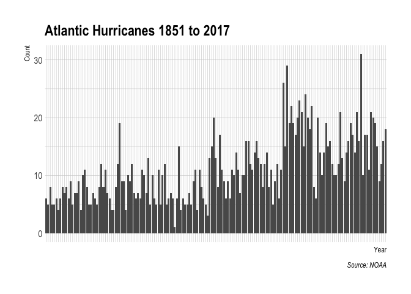
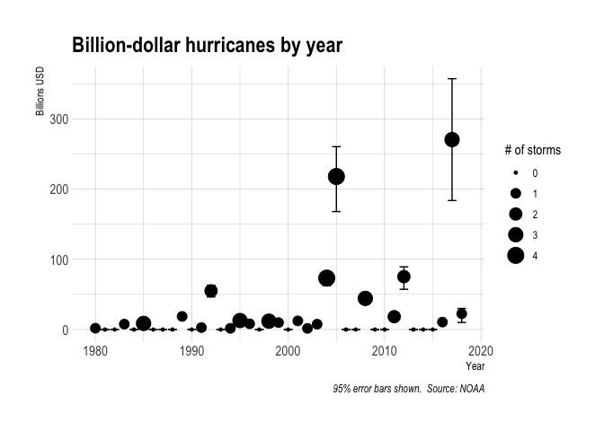
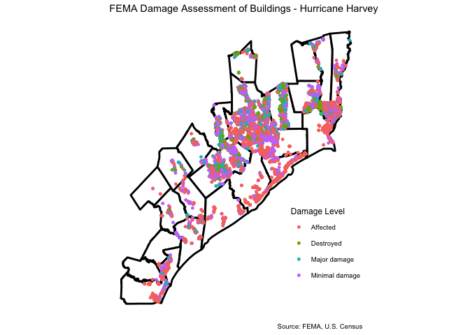

The Data Incubator - Challenge
================
Jake Johnson
11/14/2018

## Proposal

One prediction of climate change is that the intensity and rainfall
rates of cyclones will increase\[1\]. For example, in the case of
hurricane Harvey consider the following:

> … record high ocean heat values not only increased the fuel available
> to sustain and intensify Harvey but also increased its flooding rains
> on land. Harvey could not have produced so much rain without
> human-induced climate change.\[2\]

Similar flooding was observed following other recent hurricanes such as
Florence, Maria, and Michael.

Also expected to increase are the damages and costs of such storms.
These devastating effects are illustrated starkly via the use of
satellite imagery both before and after they occur. For example, this
Washington Post
[graphic](https://www.washingtonpost.com/graphics/2018/world/amp-stories/before-and-after-images-of-typhoon-yutu-destruction/)
shows the destruction brought by Super Typhoon Yutu. These pictures are
indeed worth a thousand words, but they are also documenting potentially
many thousands of dollars in damages.

Recently, efforts have been made to use such imagery as means for
automated damage detection in storm-effected areas\[3\]\[4\]. I propose
using and building on these existing methodologies to assess
storm-damaged areas and linking this information to estimates of
monetary damages. This would provide a novel approach for predicting the
costs of future storms.

## Data Sources

  - [Billion-Dollar
    Disasters](https://www.ncdc.noaa.gov/billions/time-series)

  - [Disaster Data Science Lab](https://www.ddslab.info/)

  - [FEMA National Disaster
    Assessments](https://data.femadata.com/NationalDisasters/)
    
      - [Hazus Methodology](https://www.fema.gov/hazus)

  - [FEMA Spending](https://www.usaspending.gov/#/)

  - [National Geodetic Survey](https://www.ngs.noaa.gov/)
    
      - [Emergency Response Imagery -
        Before](https://geodesy.noaa.gov/storm_archive/coastal/viewer/index.html)
      - [Emergency Response Imagery -
        After](https://storms.ngs.noaa.gov/)

  - [National Hurricane Center](https://www.nhc.noaa.gov/data/hurdat/)

  - [Homeland Infrastructure Foundation-Level
    Data](https://hifld-geoplatform.opendata.arcgis.com/)

## Plots

<!-- -->

<!-- -->

<!-- -->

1.  <https://www.gfdl.noaa.gov/global-warming-and-hurricanes/>

2.  Trenberth, K. E., Cheng, L., Jacobs, P., Zhang, Y., & Fasullo, J.
    (2018). Hurricane Harvey Links to Ocean Heat Content and Climate
    Change Adaptation. Earth’s Future, 6(5), 730–744.
    <http://doi.org/10.1029/2018EF000825>

3.  Barnes, C. F., Fritz, H., & Yoo, J. (2007). Hurricane Disaster
    Assessments With Image-Driven Data Mining in High-Resolution
    Satellite Imagery. IEEE Transactions on Geoscience and Remote
    Sensing, 45(6), 1631–1640. <http://doi.org/10.1109/TGRS.2007.890808>

4.  Cao, Q. D., & Choe, Y. (2018). Deep Learning Based Damage Detection
    on Post-Hurricane Satellite Imagery. arXiv.
    <https://arxiv.org/abs/1807.01688>
